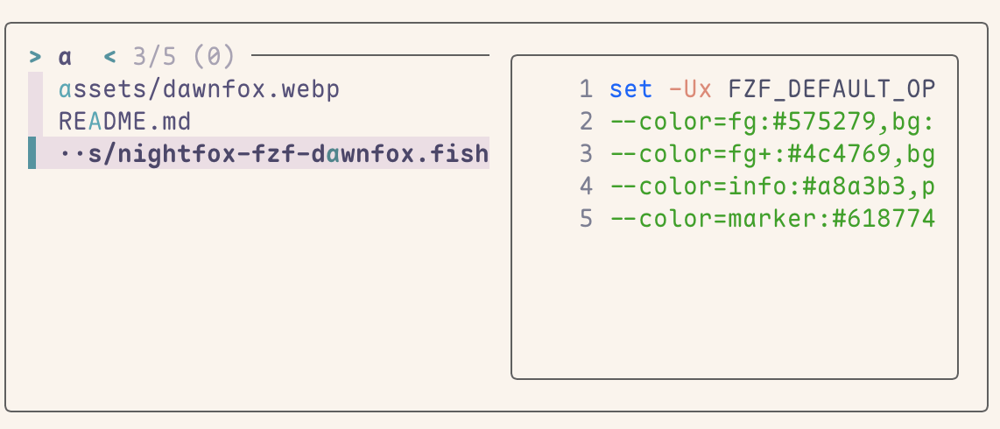

<h3 align="center">
   
	Nightfox for <a href="https://github.com/junegunn/fzf">fzf</a>
</h3>

## Previews

 Dawnfox

## Usage

Choose and run a snippet from the [themes](./themes) directory based on your shell:
- **Fish (`.fish`)**: run the Fish snippet once.
